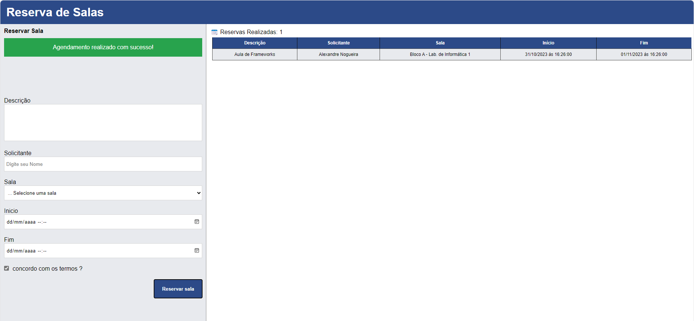

<h1 align="center">:file_cabinet: README.md</h1>

## :memo: Descrição

Projeto Voltado para atividade em sala de aula de Frameworks do IFRO.

## :books: Funcionalidades

- Cria uma lista de reserva de salas com tabelas e validação

## :wrench: Tecnologias utilizadas

- Html
- Sass
- Javascript
- classnames
- Next.js

## :camera: Screenshots



## :rocket: Rodando o projeto

## Clone este repositório

```bash
  git clone https://github.com/Alxdelira/sala-reservas.git
```

## Acesse a pasta do projeto no terminal/cmd

```bash
    cd sala-reservas
```

## Instale as dependências

```bash
    npm install
```

## Execute a aplicação em modo de desenvolvimento

### O servidor inciará na porta:3000 - acesse http://localhost:3000

```bash
    npm run dev
```

## :handshake: Colaboradores

<table>
  <tr>
    <td align="center">
      <a href="http://github.com/Alxdelira">
        <br>
        <sub>
          <b>Alxdelira</b>
        </sub>
      </a>
    </td>
  </tr>
</table>
